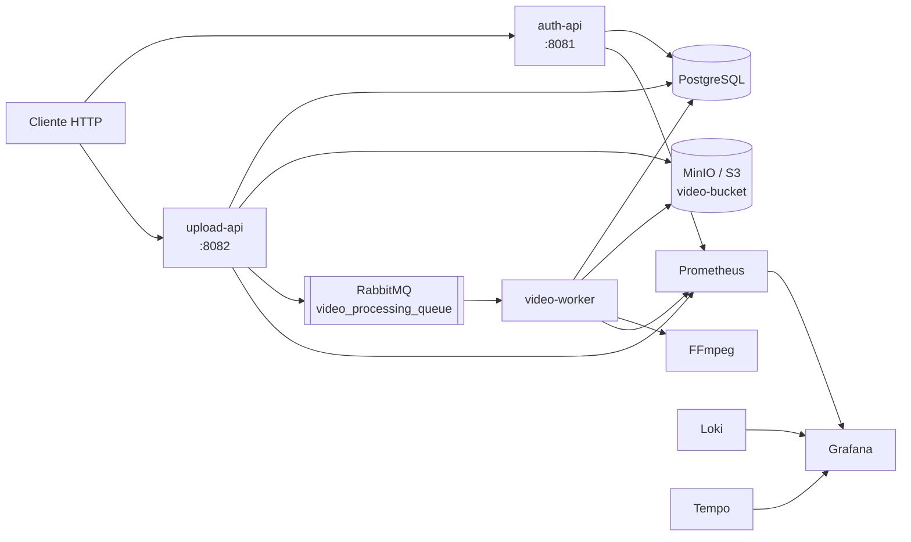
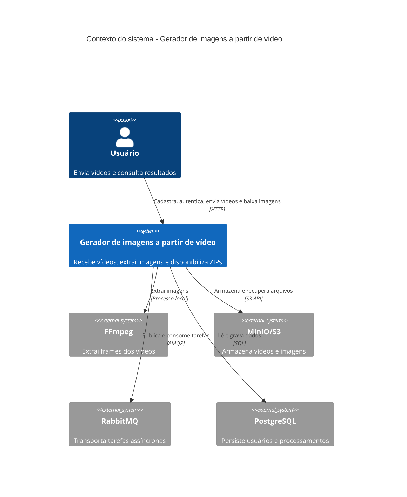
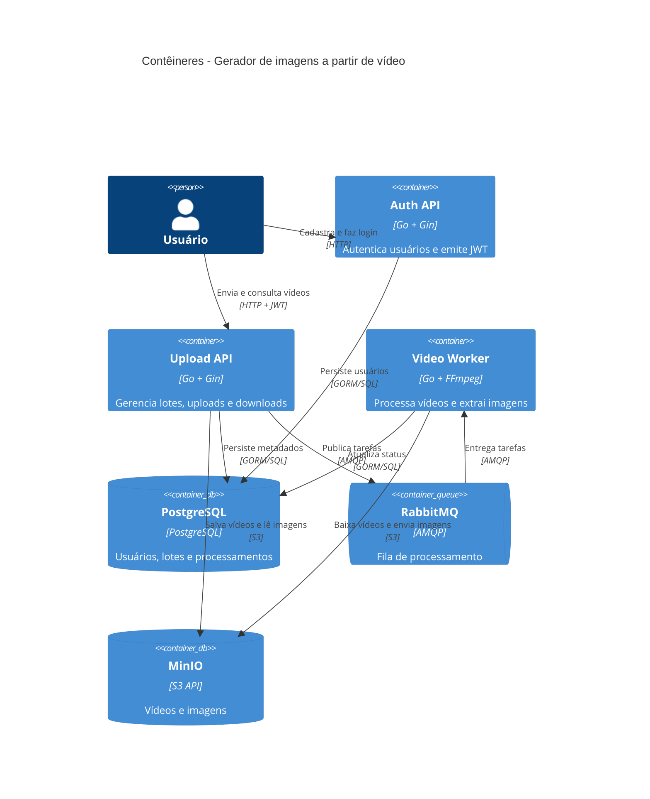

# Arquitetura

## Objetivo

O sistema recebe vídeos, processa-os de forma assíncrona com FFmpeg e disponibiliza as imagens extraídas em arquivos ZIP.

O fluxo principal é:

1. O usuário cria uma conta e obtém um JWT.
2. A `upload-api` cria um lote e recebe o vídeo.
3. O vídeo original é salvo no MinIO/S3.
4. A API registra o processamento como `PENDING` e publica uma tarefa no RabbitMQ.
5. O `video-worker` consome a tarefa, baixa o vídeo, executa o FFmpeg e envia as imagens para o storage.
6. O processamento termina como `COMPLETED` ou `FAILED`.

## Componentes

| Componente | Responsabilidade | Porta local |
| --- | --- | --- |
| `auth-api` | Cadastro, login e gerenciamento de usuários | `8081` |
| `upload-api` | Lotes, upload, status e downloads | `8082` |
| `video-worker` | Consumo da fila e extração de imagens | métricas `8083` |
| PostgreSQL | Usuários, lotes e processamentos | `5432` |
| RabbitMQ | Fila `video_processing_queue` | `5672` / painel `15672` |
| MinIO | Storage S3 para vídeos e imagens | `9000` / console `9001` |
| Grafana | Dashboards de métricas, logs e traces | `3000` |
| Prometheus | Armazenamento de métricas | `9090` |
| Loki | Armazenamento de logs | `3100` |
| Tempo | Armazenamento de traces | `3200` |
| OpenTelemetry Collector | Recebimento e encaminhamento de traces | `4319` / `4320` |
| Grafana Alloy | Coleta de logs dos containers | - |

Os serviços de aplicação seguem uma separação inspirada em arquitetura hexagonal: handlers HTTP adaptam entradas e saídas, serviços concentram regras e PostgreSQL, S3, RabbitMQ e FFmpeg ficam nos adaptadores.

## Desenho da arquitetura



## C4 - Contexto



## C4 - Contêineres



## Estrutura

```text
cmd/
  auth-api/       Entrada do serviço de autenticação
  upload-api/     Entrada da API de upload
  video-worker/   Entrada do consumidor assíncrono
internal/
  auth/           Domínio e persistência de usuários
  upload/         Domínio e persistência de uploads
  video_processing/
                  Worker, RabbitMQ, aplicação e FFmpeg
  pkg/            Banco, storage, mensageria, middleware e observabilidade
observability/    Configuração local de Prometheus, Grafana, Loki, Tempo e Alloy
```
