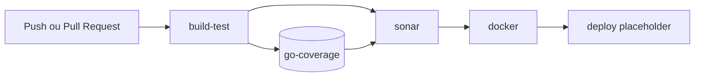

# Pipeline CI/CD

O workflow [`.github/workflows/ci-cd.yml`](../.github/workflows/ci-cd.yml) é executado em `push` e `pull_request` para `main`, `master` e `develop`.

O pipeline usa `ubuntu-latest` e Go `1.26.6`.

## Fluxo



## Jobs

### `build-test`

1. Faz checkout do repositório.
2. Configura Go com cache.
3. Executa `go mod download`.
4. Compila `auth-api`, `upload-api` e `video-worker`.
5. Executa `go test ./... -covermode=atomic -coverprofile=coverage.out`.
6. Publica `coverage.out` como artifact `go-coverage`.

### `sonar`

Depende de `build-test`, baixa a cobertura e executa a análise definida em [sonar-project.properties](../sonar-project.properties), seguida do quality gate.

Configuração necessária no GitHub:

- secret `SONAR_TOKEN`;
- secret `SONAR_HOST_URL`;
- variável `SONAR_ORGANIZATION`;
- variável opcional `SONAR_PROJECT_KEY`; sem ela, usa `github.repository`.

### `docker`

Depende de `build-test` e `sonar`. Usa uma matriz com:

- `auth-api`;
- `upload-api`;
- `video-worker`.

Cada imagem usa o [Dockerfile](../Dockerfile), passa `SERVICE=<serviço>` e recebe a tag:

```text
fiap-geradorimagens-video/<servico>:<github.sha>
```

O workflow atual usa `push: false`, então apenas constrói as imagens e não publica em registry.

### `deploy`

Depende de `docker`, mas atualmente é um placeholder que imprime uma mensagem. O deploy real ainda precisa incluir registry, credenciais e atualização do ambiente destino.
