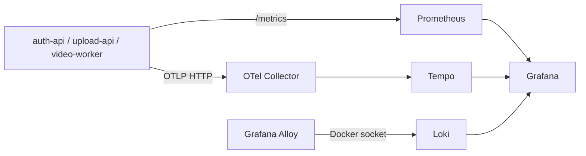

# Observabilidade local

A stack local usa Prometheus para métricas, OpenTelemetry/Tempo para traces, Loki/Alloy para logs e Grafana para consulta.

## Acessos

- Grafana: `http://localhost:3000` (`admin` / `admin`)
- Dashboard: `http://localhost:3000/d/fiap-observability/fiap-observabilidade`
- Prometheus: `http://localhost:9090`
- Tempo: `http://localhost:3200`
- Loki: `http://localhost:3100`

Os datasources Prometheus, Loki e Tempo são provisionados automaticamente.

## Métricas

Endpoints expostos:

```bash
curl http://localhost:8081/metrics
curl http://localhost:8082/metrics
curl http://localhost:8083/metrics
```

Consultas PromQL úteis no Prometheus ou Grafana Explore > Prometheus:

```promql
up
```

```promql
fiap_http_requests_total
```

```promql
sum by (service) (rate(fiap_http_requests_total[5m]))
```

```promql
histogram_quantile(0.95, sum by (service, le) (rate(fiap_http_request_duration_seconds_bucket[5m])))
```

```promql
sum by (status) (increase(fiap_worker_messages_total[1h]))
```

```promql
histogram_quantile(0.95, sum by (service, le) (rate(fiap_worker_processing_duration_seconds_bucket[5m])))
```

A dashboard FIAP já exibe requisições por segundo, latência p95, mensagens do worker e duração do processamento.

## Logs

No Grafana, abra **Explore**, selecione **Loki** e escolha um intervalo como `Last 15 minutes`.

Consultas LogQL:

```logql
{service="video-worker"}
```

```logql
{service="video-worker"} |= "processing_started"
```

```logql
{service="video-worker"} |= "ffmpeg"
```

```logql
{service="video-worker"} |= "image_upload_failed"
```

```logql
{service="video-worker"} |= "processing_completed"
```

Para os outros serviços:

```logql
{service="auth-api"}
{service="upload-api"}
```

Os logs do worker incluem `processing_id`, `batch_id`, etapa, duração, `trace_id` e `span_id`.

No terminal:

```bash
docker compose logs -f video-worker
docker compose logs --tail=200 video-worker
```

Se aparecer `No logs volume available`, confirme que o intervalo inclui eventos recentes e que o seletor usa `service`, por exemplo `{service="video-worker"}`. Logs antigos podem ter sido gravados com `service_name="unknown_service"` antes da correção do Alloy.

## Traces

No Grafana, abra **Explore**, selecione **Tempo** e pesquise por:

- `auth-api`;
- `upload-api`;
- `video-worker`.

Operações comuns:

```text
POST /v1/login
GET /v1/uploads
POST /v1/uploads/:id/processings
rabbitmq.publish
rabbitmq.consume
```

O contexto W3C é propagado nos headers RabbitMQ, conectando o upload ao processamento assíncrono do worker.

O Tempo também pode ser consultado diretamente:

```bash
curl "http://localhost:3200/api/search?limit=20"
```

## Fluxo da telemetria


